# SPRING PLUS 과제 제출

---
### 필수 LV 1️⃣ - 코드 퀴즈 

#### 1. 코드 개선 - @Transaction의 이해
- TodoService에 클래스 레벨로 읽기 전용의 @Transactional이 걸려 있어 saveTodo() 메서드에 별도 쓰기가능한 트랜잭션인 @Transactional을 적용

#### 2. 코드 추가 - JWT의 이해
- nickname 필드 추가
- 토큰 정보 claim에 nickname 필드를 추가하여 클라이언트에서 닉네임을 꺼낼 수 있도록 변경
- AuthUser에도 추가하여 서버에서도 @Auth를 통해서 인증 완료된 유저의 정보를 편리하게 꺼낼 수 있도록 변경

#### 3. 코드 개선 - JPA의 이해
- 할일 전체 조회 API인 getTodos()에 검색 조건을 하고 @Query()를 활용하여 날씨와 수정일 기준의 기간검색이 가능하도록 수정
- 검색 조건인 TodosSearchCond 클래스를 생성하여 요청 파라미터로 검색 조건을 받을 수 있으며 검색 조건이 없어도 실행 가능함

#### 4. 테스트 코드 - 컨트롤러 테스트의 이해
- 실패하는 테스트의 then 코드가 ok로 되어있던 것을 isBadRequest(), HttpStatus.BAD_REQUEST로 변경하여 성공하도록 변경

#### 5. 코드 개선 - AOP의 이해
- 요구사항대로 돌아가도록 @After애노테이션을 @Before 로 변경하여 실행 전에 AOP가 동작하도록 수정
---
### 필수 LV 2️⃣

#### 6. JPA Cascade - 영속성 전이
- 할 일을 새로 저장할 시 할일을 생성한 유저가 자동으로 등록되도록 Todo Entity의 private List<Manager> managers 필드 연관관계 매핑옵션에 cascade = CascadeType.PERSIST을 설정

#### 7. N + 1
- getComments() API의 N + 1문제를 fetch join을 활용하여 문제를 해결
- Page 객체로 반환하지 않으므로 단순하게 문제를 해결하였으며 만약 Page 객체를 활용했다면 @EntityGraph나 querydsl로 별도의 쿼리를 작성하여 문제를 해결했을 것임

#### 8. querydsl
- findByIdWithUser() 메서드를 querydsl로 변경
- n + 1 문제가 발생하지 않도록 fetchJoin() 메서드 사용

#### 9. Spring Security
- 외부 패스워드 인코더 라이브러리를 Spring Security가 제공하는 PasswordEncoder로 변경
- @Auth 애노테이션과 Argument Resolver를 사용하여 인증 객체를 사용하던 코드를 @AuthenticationPrincipal과 CustomUserDetails를 사용하도록 변경
- FilterConfig를 제거하고 SecurityConfig를 생성하여 여기서 JwtUtil을 사용하도록 변경하고 인증 없이 통과할 API와 인증이 필요한 API를 구분
- Spring Security와 호환되는 새로운 JwtAuthenticationFilter를 생성하여 필터 체인으로 Jwt 토큰을 검증하도록 설정
- Spring Security 도입으로 실패하게된 테스트 코드를 정상 동작하도록 mock을 활용하여 mockUser를 생성하고 @AutoConfigureMockMvc(addFilter = false) 설정을 통해 필터가 동작하지 않도록 변경
---

### 도전 LV 3️⃣

#### 10. querydsl 활용하여 새로운 api 개발
- 요구사항에 맞춰 검색조건에 따른 할일 제목을 전체조회하는 searchTodoTitles() API를 개발
- 필요한 페이징 정보만 반환하도록 페이징 공통 반환 객체를 작성하여 적용
- 페이징과 join을 함께 적용해야 하므로 최대 1(내용 쿼리) + 1(count 쿼리) 쿼리만 발생하도록 작성
- 요구사항에 따라 @QueryProjection이 아닌 Projections를 활용하여 querydsl 쿼리를 작성
- 제목, 닉네임 부분검색 적용, 없어도 조회 가능
- 생성일 기준으로 검색 적용, 없어도 조회 가능
- 제목, 담당자 수, 총 댓글 갯수만 반환하도록 별도의 응답 DTO 생성

#### 11. Transaction 심화
- 외부 트랜잭션이 롤백 되어도 내부 트랜잭션은 성공하도록 REQUIRES_NEW 옵션을 활용하여 saveManager() API 성공, 실패 로그를 출력
- Log Entity에는 id, 실행된 메소드 이름, 도메인, 성공/실패 여부, 로그 생성 시각이 적용됨
- spring data JPA를 활용하였고 repository 에서 @Transactional(propagation = Propagation.REQUIRES_NEW)을 사용하는 것은 좋지 않은 설계같아서 LogService에서 트랜잭션을 적용하고, 로그 성공과 실패 메서드를 각각 만들어서 적용하였음

#### 12. AWS 활용
- 인프라 구조
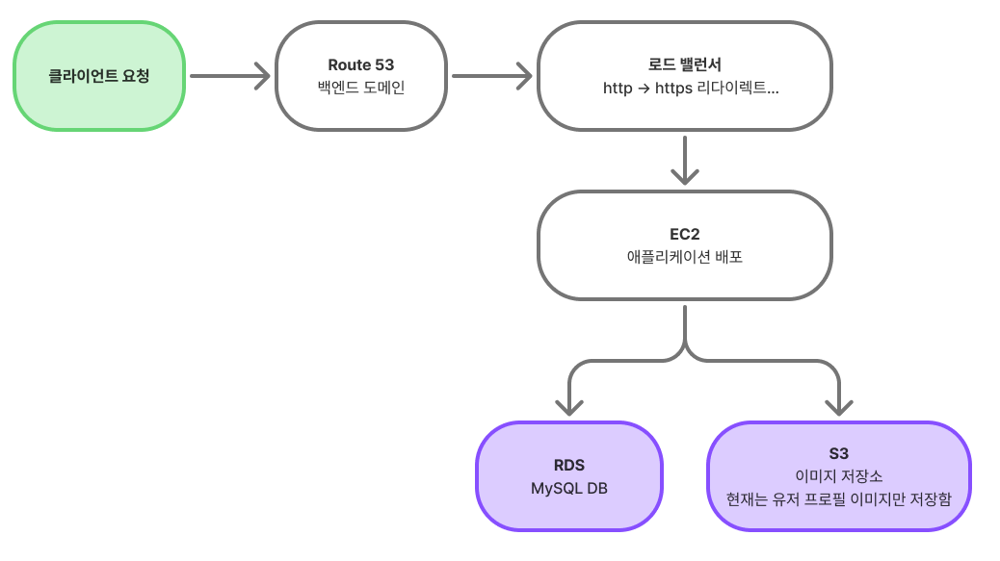

1. 도메인 설정 스크린 샷
- 도메인을 구입하여 Route 53, 가비아 DNS 설정완료
- Alias 레코드를 생성하여 구입한 도메인으로 로드벨런서에 접근하도록 설정
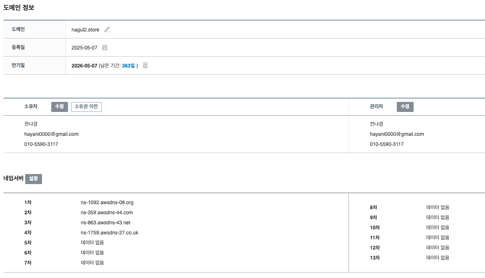
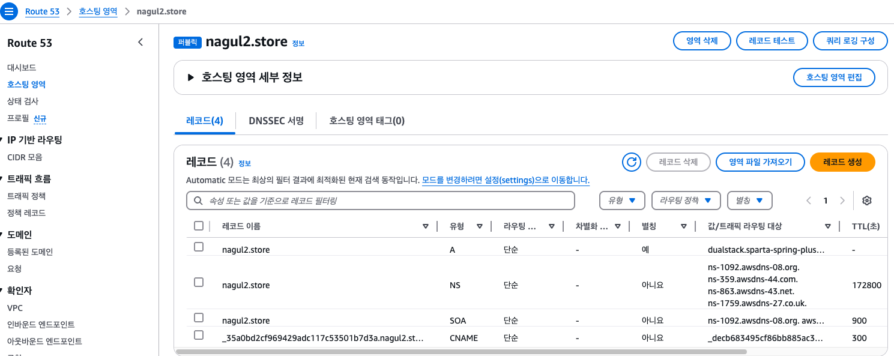

2. 탄력적 IP 스크린샷
- SSH 접속 시 EC2가 재부팅 되었을 때 IP가 변경되지 않도록 하기 위함
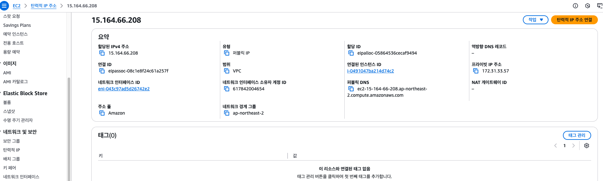
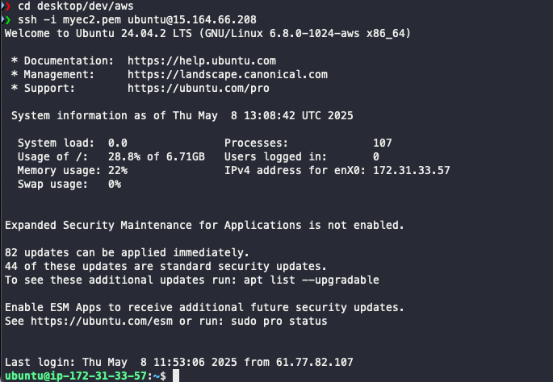

3. EC2 설정 스크린샷
- S3에 접근 및 제어를 위한 IAM 역할 부여
- 인바운드 규칙에 SSH, 로드밸런서 http 내부 통신 허용
- 아웃바운드 규칙에 rds 통신 허용
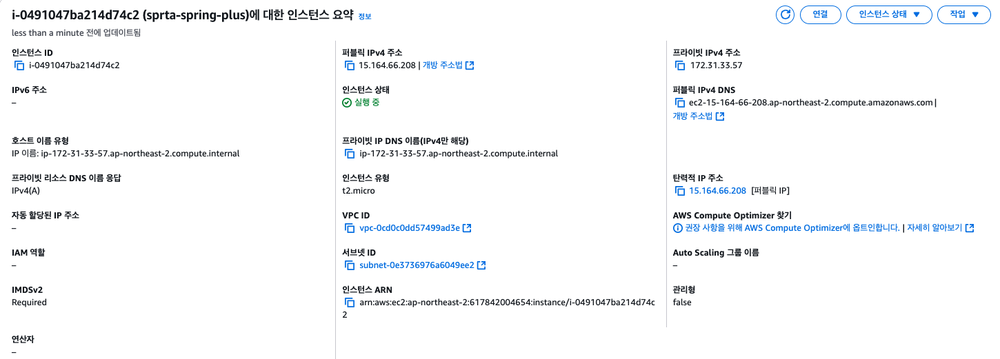
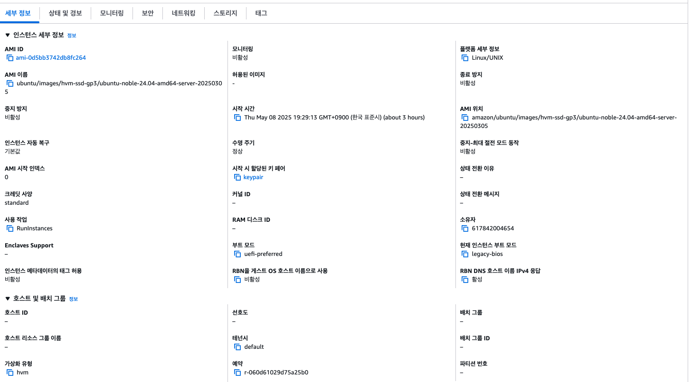
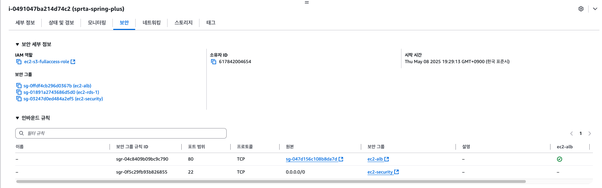
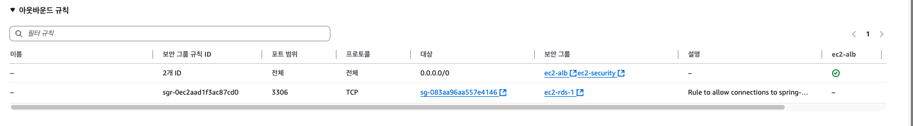

4. 로드 밸런서 설정 스크린샷
- 단일 EC2 서버 아키텍처이지만 로드 밸런서를 통해 http 요청을 https로 리다이렉트 시키도록 설정
- EC2와 http로 통신하고 외부 요청은 http는 https로 리다이렉트 하기 때문에 https만 통신됨
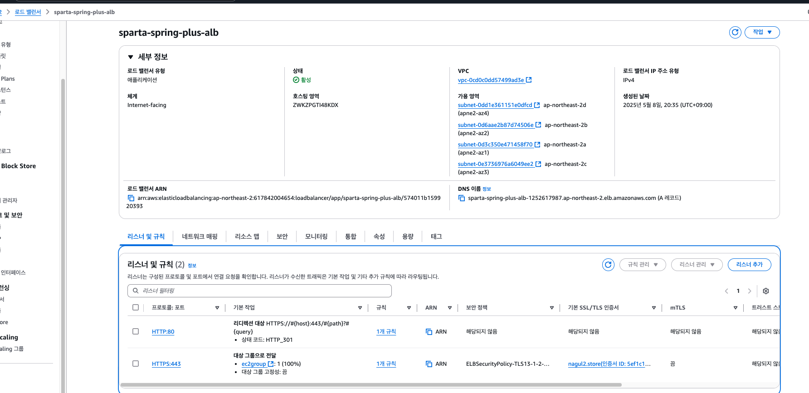

5. HTTPS 접속을 위한 SSL 인증서 발급 스크린샷
- 구입한 도메인이 등록된 Route 53에 CNAME 레코드 생성
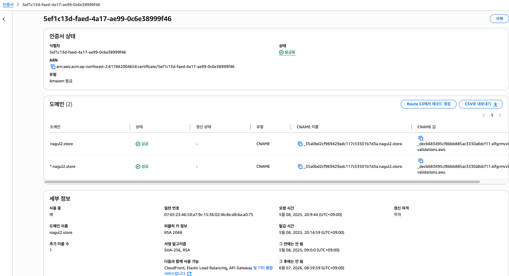

6. RDS 설정 스크린샷
- EC2 보안그룹 연결 설정 적용
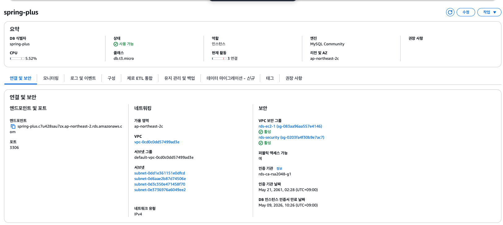
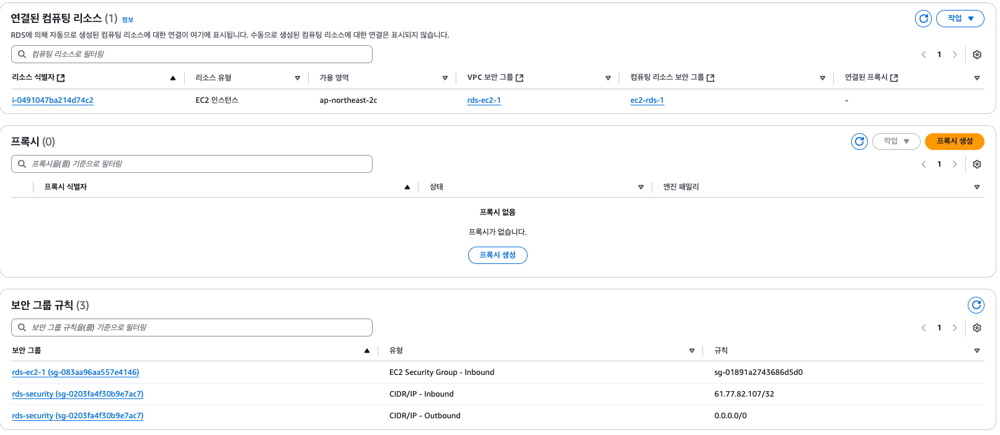

7. S3 설정 스크린샷 
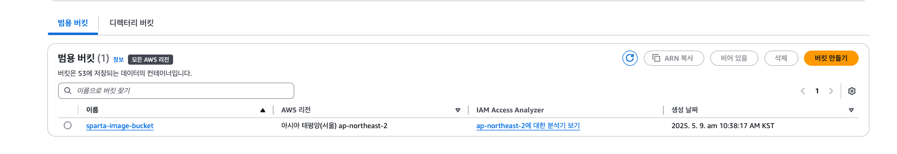

8. health check API 개발
- 애플리케이션 실행 상태, DB 연동 상태를 체크하는 health check API 개발
- 엑츄에이터 라이브러리를 사용하면 바로 사용할 수 있지만 여기서는 API를 직접 개발하는 것을 목표로 하는 것 같아서 직접 구현함

9. 유저 프로필 이미지 업로드 및 관리 API 개발
- 유저 등록 시 유저 프로필을 생성하는 비즈니스 추가 개발
- 유저 생성시 이미지를 등록하지 않는다면 기본 이미지가 등록되도록 구성 
- 따로 프로필을 삭제하거나 수정할 수 있도록 별도의 수정/삭제 API 개발
- local DB 환경과 서버 배포시 DB환경에 따라 별도로 실행 되도록 profile을 활용하여 설정을 분리

#### 13. 대용량 데이터 처리 - 절대 로컬에서 실행할 것, 천만 ~ 1억건 정도

---
### 도전 LV 4️⃣ - Kotlin 적용

#### 14. Entity 및 Repository CRUD 리팩토링 (Todo)

#### 15. 모든 핵심 비즈니르 로직 코드(엔티티, 서비스, 레포지토리 등)를 Kotlin으로 전환 
